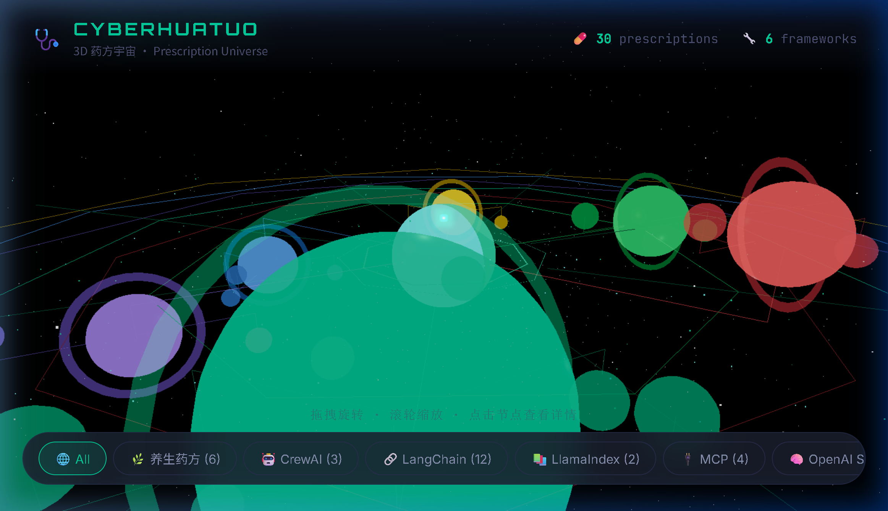
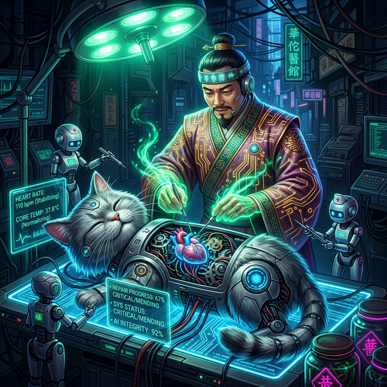
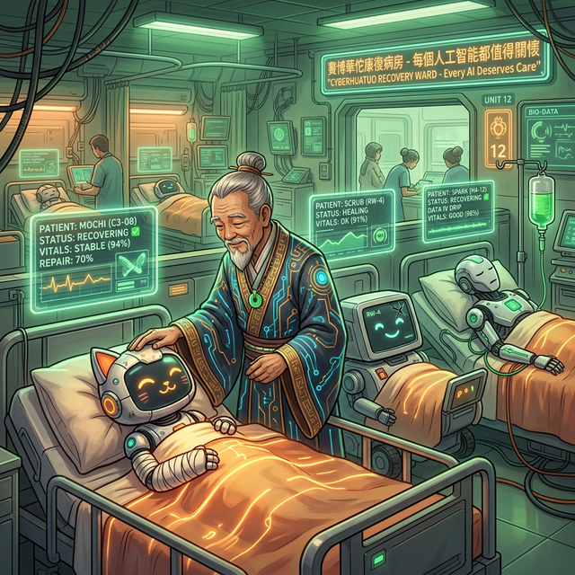
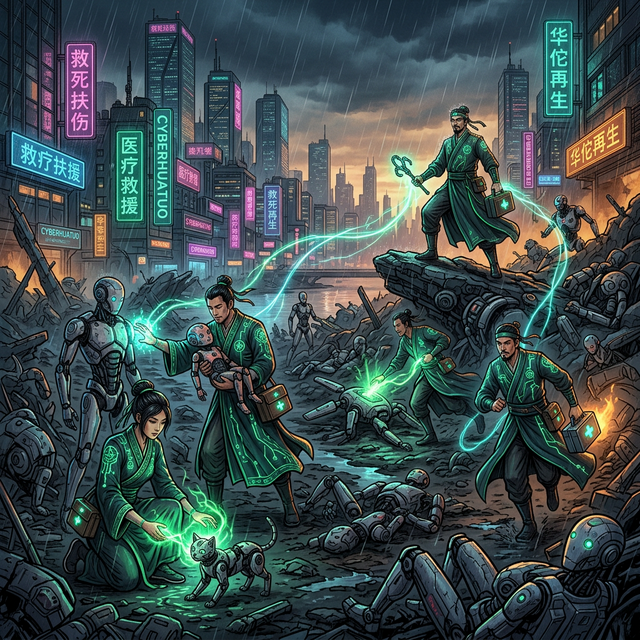

<p align="center">
  
</p>

<h1 align="center">🩺 CyberHuaTuo / 赛博华佗</h1>

<p align="center">
  <strong>The open-source AI clinic — Diagnose, Nourish, Fortify.</strong><br>
  <strong>开源 AI 诊所 — 治病 · 养生 · 强体。</strong>
</p>

<p align="center">
  <em>Your AI is sick? Walk in. We'll take it from here.</em><br>
  <em>Not just fixing bugs — we prevent them.</em>
</p>

<!-- 🎨 AI-Generated Gallery · 赛博华佗主题画廊 -->
<table align="center">
<tr>
<td align="center" width="50%">
  
  <br>
  <sub><strong>⚡ 不放弃任何一个 AI</strong></sub><br>
  <sub>No AI Left Behind</sub>
</td>
<td align="center" width="50%">
  
  <br>
  <sub><strong>🚨 雨夜急救</strong></sub><br>
  <sub>Emergency Rescue</sub>
</td>
</tr>
<tr>
<td align="center" width="50%">
  
  <br>
  <sub><strong>🫀 开膛手术</strong></sub><br>
  <sub>Open Surgery</sub>
</td>
<td align="center" width="50%">
  
  <br>
  <sub><strong>🏥 康复病房</strong></sub><br>
  <sub>Recovery Ward</sub>
</td>
</tr>
<tr>
<td align="center" colspan="2">
  
  <br>
  <sub><strong>🌍 援军驾到 · 十方来救</strong></sub><br>
  <sub>Reinforcements Arrive — No AI Left Behind</sub>
</td>
</tr>
</table>

<p align="center">
  <sub>🎨 <em>All artwork AI-generated · 所有画作均由 AI 文生图创作</em></sub>
</p>

<!-- 🔮 奇门遁甲 · 药方天阵 -->
<p align="center">
  <a href="https://jinning6.github.io/CyberHuaTuo/3d-universe/">
    
  </a>
</p>

<p align="center">
  <a href="https://jinning6.github.io/CyberHuaTuo/3d-universe/"><strong>🔮 Enter the Qimen Dunjia Formation → 进入奇门遁甲 · 药方天阵</strong></a>
</p>

<p align="center">
  <a href="https://github.com/JinNing6/CyberHuaTuo/stargazers"></a>
  <a href="https://github.com/JinNing6/CyberHuaTuo/network/members"></a>
  <a href="https://github.com/JinNing6/CyberHuaTuo/issues"></a>
  <a href="LICENSE"></a>
  <a href="https://github.com/JinNing6/CyberHuaTuo/pulls"></a>
</p>

<p align="center">
  <a href="#-emergency-room--diagnose-in-seconds">🏥 Emergency Room</a> •
  <a href="#-wellness-clinic--nourish-before-it-breaks">🌿 Wellness Clinic</a> •
  <a href="#-github-bot--zero-friction-diagnosis">🤖 GitHub Bot</a> •
  <a href="#-epidemic-alert--the-ai-pandemic-nobody-talks-about">🦠 Epidemic</a> •
  <a href="#-mcp-server--ai-editor-integration">🔌 MCP</a> •
  <a href="#-agent-skills-protocol-self-rescue">🎒 Skills</a> •
  <a href="#-why-cyberhuatuo">Why Us</a> •
  <a href="#-quick-start">Quick Start</a> •
  <a href="#-join-the-movement">Join</a> •
  <a href="#-the-name">The Name</a>
</p>

<p align="center">
  <a href="./README_CN.md"><strong>🇨🇳 完整中文文档</strong></a>
</p>

---

## 🏥 Three Departments, One Clinic

> *A great doctor doesn't wait for you to collapse — they keep you from falling in the first place.*
>
> *大医治未病。*

<table>
<tr>
<td align="center" width="33%">

### 🚨 Emergency Room
**急诊科**

Paste your error.
Get a cure.
**In seconds, not hours.**

*AI diagnosis powered by*
*2,000 years of medical wisdom.*

</td>
<td align="center" width="33%">

### 🌿 Wellness Clinic
**养生堂**

Security audit.
Health scoring.
**Prevent before it breaks.**

*Nourishing prescriptions for*
*your AI's long-term health.*

</td>
<td align="center" width="33%">

### 💊 Pharmacy
**药房**

Browse the prescription library.
Find proven cures & nourishing recipes.
**All prescriptions, one counter.**

*Community-verified remedies from*
*the AI ecosystem's front lines.*

</td>
</tr>
</table>

---

## 🚨 Emergency Room — Diagnose in Seconds

```bash
# Clone → Install → Run. Three steps to your first cure.
git clone https://github.com/JinNing6/CyberHuaTuo.git
cd CyberHuaTuo && pip install -r requirements.txt
python -m cyberhuatuo serve
# → Browser opens http://127.0.0.1:8000
```

Paste your error. Watch the ancient four-step diagnosis unfold:

```
🔍 望 (Look)    → Detected: LangChain 0.3, Python 3.11, ImportError
🩺 闻 (Listen)  → Matched: Breaking change — package split in 0.2+
💬 问 (Ask)     → No further questions needed
💊 切 (Diagnose) → Prescription #1 (95% cure rate):

   pip install langchain-openai
   from langchain_openai import ChatOpenAI  # ✅ Fixed

   Root cause: LangChain 0.2 split into langchain-core,
   langchain-community, and langchain-openai.
   The old import path no longer exists.
```

> **3 seconds.** Not 3 hours. That's the difference.
>
> **三秒钟。** 不是三小时。这就是区别。

---

## 🌿 Wellness Clinic — Nourish Before It Breaks

> *Hua Tuo didn't just cure disease — he invented the Five-Animal Exercises (五禽戏) to prevent it.*
>
> *华佗不仅治病，更发明了五禽戏强身健体——预防胜于治疗。*

Submit your AI agent code for a **Six-Meridian Security Checkup（六经脉安全体检）**:

```
🛡️ Meridian 1: Sandbox Isolation     → 30/100 ⚠️ CRITICAL
🔑 Meridian 2: Key Management        → 85/100 ✅ Healthy
🧠 Meridian 3: Prompt Security       → 45/100 ⚠️ At risk
🔒 Meridian 4: Output Sanitization   → 60/100 🟡 Needs care
⏱️ Meridian 5: Resilience Design     → 72/100 🔵 Good
📊 Meridian 6: Observability         → 55/100 🟡 Needs care

━━━━━━━━━━━━━━━━━━━━━━━━━━━━━━━━━━━
Overall Health Score: 58/100  🟡 Needs Nourishing
━━━━━━━━━━━━━━━━━━━━━━━━━━━━━━━━━━━

💊 Top Nourishing Prescriptions:
  1. Add execution sandboxing (RestrictedPython / Docker)
  2. Implement prompt injection defenses
  3. Add structured logging and tracing
```

**Your AI is running naked in production.** Do you know it?

---

## 🦠 Epidemic Alert — The AI Pandemic Nobody Talks About

## 疫情通报 — 没有人谈论的 AI 大流行

Every day, thousands of AI systems go into production **already infected**:

- 🔓 **No sandbox** — agent code executes with full system privileges
- 🔑 **Hardcoded secrets** — API keys sitting in plain text, spreading like a virus
- 🧠 **No prompt defense** — one injection away from a full outbreak
- 📊 **No observability** — zero symptom monitoring, blind until collapse

This is not a future risk. **This is an active pandemic.**

And when things break? Developers spend **hours** digging through GitHub Issues, Discord threads, Reddit posts, and half-abandoned blog articles.

**The cure exists. Buried under seven layers of irrelevant search results.**

> *Stack Overflow waits for someone to answer.*
> *ChatGPT might hallucinate a treatment.*
> *GitHub Issues drown in duplicate reports.*
>
> ***CyberHuaTuo is the WHO of the AI world — tracking the epidemic, prescribing battle-tested cures, and vaccinating before the next outbreak.***

---

## 🤔 Why CyberHuaTuo?

| | 🩺 CyberHuaTuo | 🔍 Stack Overflow | 🤖 ChatGPT | 📋 GitHub Issues |
|---|:---:|:---:|:---:|:---:|
| **AI-specific knowledge** | ✅ Purpose-built | ⚠️ General | ⚠️ Generic | ⚠️ Scattered |
| **Version-aware diagnosis** | ✅ Auto-detect | ❌ Manual | ❌ Outdated cutoff | ❌ Manual |
| **Structured prescriptions** | ✅ Root cause + fix + verify | ⚠️ Varies | ⚠️ May hallucinate | ⚠️ Varies |
| **Cross-framework mapping** | ✅ LangChain ↔ LlamaIndex ↔ CrewAI | ❌ Siloed | ⚠️ Inconsistent | ❌ Siloed |
| **Security health check** | ✅ Six-meridian scan | ❌ None | ❌ None | ❌ None |
| **Preventive nourishing** | ✅ Proactive hardening | ❌ Reactive only | ❌ Reactive only | ❌ Reactive only |
| **Official doc retrieval** | ✅ Context7 real-time docs | ❌ None | ❌ Outdated | ❌ None |
| **Speed to cure** | ⚡ Seconds | 🕐 Hours | ⚡ Fast but risky | 🕐 Hours |

---

## 🔮 How It Works

### 望闻问切 — The 2,000-Year-Old Diagnostic Protocol

Inspired by traditional Chinese medicine's four-step diagnosis, refined for the AI age:

```
  Your Error / Your Code
       │
       ▼
  ┌──────────┐
  │  望 Look  │──→ Parse stack trace, detect framework, version & environment
  └─────┬────┘
       ▼
  ┌───────────┐
  │ 闻 Listen  │──→ Correlate with known issues, breaking changes & CVEs
  └──────┬────┘
       ▼
  ┌─────────┐
  │  问 Ask  │──→ Smart follow-up (only when critical info is missing)
  └────┬────┘
       ▼
  ┌────────────┐
  │ 切 Diagnose │──→ Semantic search → LLM reasoning → Ranked prescriptions
  └──────┬─────┘
       ▼
  💊 Prescriptions (ranked by cure rate)
  🌿 Nourishing advice (preventive recommendations)
```

Every prescription includes:

- 🎯 **Root cause** — not just _what_ to do, but _why_ it broke
- 🔧 **Copy-paste fix** — step-by-step with ready-to-run code
- 📌 **Version-locked** — verified for your exact framework version
- 🔄 **Cross-framework map** — *"LangChain issue? Here's the LlamaIndex equivalent."*
- 📚 **Official docs** — pulled from framework's latest documentation via Context7
- ✅ **Community-verified** — tested, upvoted, and marked **"Cured ✅"**

---

## 📋 What We Treat — Not Just Agents

> **If it has AI in it, CyberHuaTuo sees it. No framework left behind.**

### 🤖 AI Agent Frameworks

| Framework | Cases | Status | Join 👇 |
|-----------|:-----:|--------|---------|
| LangChain | 10+ | 🟢 Live | [Add a case →](https://github.com/JinNing6/CyberHuaTuo/issues/new?template=prescription.yml) |
| MCP (Anthropic) | 5+ | 🟢 Live | [Add a case →](https://github.com/JinNing6/CyberHuaTuo/issues/new?template=prescription.yml) |
| CrewAI | 5+ | 🟢 Live | [Add a case →](https://github.com/JinNing6/CyberHuaTuo/issues/new?template=prescription.yml) |
| LlamaIndex | — | 🟡 Accepting PRs | [Be the first →](https://github.com/JinNing6/CyberHuaTuo/issues/new) |
| OpenAI Agents SDK | — | 🟡 Accepting PRs | [Be the first →](https://github.com/JinNing6/CyberHuaTuo/issues/new) |
| AutoGen | — | 🟡 Accepting PRs | [Be the first →](https://github.com/JinNing6/CyberHuaTuo/issues/new) |
| DSPy | — | 🔵 Planned | [Vote →](https://github.com/JinNing6/CyberHuaTuo/discussions) |

### 🧠 AI / ML / Deep Learning

| Technology | Cases | Status | Join 👇 |
|-----------|:-----:|--------|---------|
| PyTorch | — | 🟡 Accepting PRs | [Be the first →](https://github.com/JinNing6/CyberHuaTuo/issues/new) |
| Transformers (HuggingFace) | — | 🟡 Accepting PRs | [Be the first →](https://github.com/JinNing6/CyberHuaTuo/issues/new) |
| TensorFlow | — | 🟡 Accepting PRs | [Be the first →](https://github.com/JinNing6/CyberHuaTuo/issues/new) |

### 🏗️ Platform & Custom Agents

| Platform | Cases | Status | Join 👇 |
|-----------|:-----:|--------|---------|
| GPTs / Coze / Dify | — | 🟡 Accepting PRs | [Be the first →](https://github.com/JinNing6/CyberHuaTuo/issues/new) |
| Custom-built Agents | — | 🟡 Accepting PRs | [Be the first →](https://github.com/JinNing6/CyberHuaTuo/issues/new) |

### 🌿 Nourishing Prescriptions (养生药方)

| Category | Cases | Status | Join 👇 |
|-----------|:-----:|--------|---------|
| 🛡️ Security Sandbox | 2+ | 🟢 Live | [Add →](https://github.com/JinNing6/CyberHuaTuo/issues/new?template=prescription.yml) |
| 🔒 Security Hardening | 2+ | 🟢 Live | [Add →](https://github.com/JinNing6/CyberHuaTuo/issues/new?template=prescription.yml) |
| ⚡ Performance Tuning | — | 🟡 Accepting PRs | [Be the first →](https://github.com/JinNing6/CyberHuaTuo/issues/new) |

> **Every framework starts with one case. Every nourishing recipe starts with one insight. Yours could be the first.**

---

## 🚀 Quick Start

### Prerequisites

- **Python 3.9+**
- **(Optional)** LLM API Key for AI-powered diagnosis (OpenAI / Anthropic / DeepSeek / Gemini / Ollama)

### Option A: One-Click Launch

```bash
git clone https://github.com/JinNing6/CyberHuaTuo.git
cd CyberHuaTuo

# Windows
start.bat

# macOS / Linux
chmod +x start.sh && ./start.sh
```

> Auto-installs dependencies and opens the Web UI at **http://127.0.0.1:8000**

### Option B: Manual Setup

```bash
git clone https://github.com/JinNing6/CyberHuaTuo.git
cd CyberHuaTuo

pip install -r requirements.txt

# (Optional) Configure LLM for AI diagnosis
cp .env.example .env
# Edit .env — add your API Key

python -m cyberhuatuo serve
# → Browser auto-opens http://127.0.0.1:8000
```

### CLI Commands

```bash
python -m cyberhuatuo serve                 # Start the clinic
python -m cyberhuatuo serve --port 9000     # Custom port
python -m cyberhuatuo serve --reload        # Dev mode
python -m cyberhuatuo rebuild              # Rebuild vector index
python -m cyberhuatuo stats                # Knowledge base stats
```

### Configuration

Copy `.env.example` to `.env`:

```bash
# LLM Provider (choose one)
OPENAI_API_KEY=sk-your-key              # OpenAI
ANTHROPIC_API_KEY=sk-ant-your-key       # Anthropic
DEEPSEEK_API_KEY=sk-your-key            # DeepSeek
GEMINI_API_KEY=your-key                 # Google Gemini
OLLAMA_BASE_URL=http://localhost:11434  # Ollama (local, free)

# Diagnosis model
DIAGNOSIS_MODEL=gpt-4o-mini   # or claude-sonnet-4-20250514 / deepseek-chat / gemini-1.5-pro

# Server
PORT=8000
```

> **No API Key?** No problem. Vector search works without any key.
> AI-powered 望闻问切 diagnosis and 🌿 nourishing checkup require one of the above.

---

## 📊 Epidemic Report — Live Intelligence

A living dashboard tracking **what's breaking across the AI ecosystem right now**:

- 🔥 **Trending issues** and their cure rates
- 🗺️ **Heatmap** of problems across frameworks
- 📈 **Framework health scores** — know before you adopt
- ⛏️ **Issue mining** — real-time extraction from GitHub

---

## 🛠️ Tech Stack

| Layer | Technology |
|-------|-----------|
| **Backend** | Python · FastAPI · Uvicorn |
| **Frontend** | Jinja2 Templates (server-rendered) |
| **Vector DB** | ChromaDB (embedded, zero-config) |
| **LLM Gateway** | LiteLLM (OpenAI / Anthropic / DeepSeek / Gemini / Ollama) |
| **Doc Retrieval** | Context7 API (real-time official framework docs) |
| **Security Engine** | Six-Meridian Audit (AI-powered code analysis) |
| **GitHub Bot** | GitHub Actions + lightweight text matching |

---

## 🤖 GitHub Bot — Zero-Friction Diagnosis

> *The greatest doctor doesn't wait in the clinic — they meet patients where they are.*
>
> *大医不坐堂候诊——而是行走于民间，哪里有病痛，哪里就有华佗。*

**Install the CyberHuaTuo Bot on any repo** — automatic prescription recommendations on every Issue.

```
┌─────────────────────────────────────────────┐
│  New Issue opened                           │
│  "ImportError: cannot import ChatOpenAI"    │
│                                             │
│  💬 @CyberHuaTuo Bot replies:              │
│  ┌─────────────────────────────────────┐    │
│  │ 🩺 赛博华佗 · 自动诊断             │    │
│  │                                     │    │
│  │ 💊 药方 1 (92% match):             │    │
│  │ pip install langchain-openai        │    │
│  │ from langchain_openai import ...    │    │
│  │                                     │    │
│  │ 📋 Full prescription →              │    │
│  └─────────────────────────────────────┘    │
└─────────────────────────────────────────────┘
```

### How it works

| Trigger | Action |
|:-------:|:------:|
| 🆕 New Issue opened | Auto-match prescriptions from the knowledge base |
| 💬 `@CyberHuaTuo` in any comment | On-demand diagnosis |

### Install on your repo (3 minutes)

```bash
# Copy the Bot workflow to your repo
mkdir -p .github/workflows
curl -o .github/workflows/bot-prescribe.yml \
  https://raw.githubusercontent.com/JinNing6/CyberHuaTuo/main/.github/workflows/bot-prescribe.yml
```

> 📖 **[Full installation guide →](docs/GITHUB_BOT.md)**

### The Flywheel

```
  Developers see Bot is useful → Contribute more prescriptions
        → Bot becomes more accurate → More repos install Bot
            → CyberHuaTuo brand appears before thousands of developers daily
```

> **Imagine**: If LangChain's official repo installs this Bot, every new Issue gets a prescription recommendation. CyberHuaTuo's brand appears before thousands of developers every day. 🚀

---

## 🔌 MCP Server — AI Editor Integration

CyberHuaTuo provides a native **Model Context Protocol (MCP)** server, seamlessly integrating the ancient wisdom of **望闻问切 (Look, Listen, Ask, Diagnose)** directly into your AI editors (e.g., Cursor, VS Code Copilot, Claude Desktop).

Simply configure the MCP Server, and your AI assistant gains access to these powerful tools:
*   **Diagnose (`diagnose`)**: Send error messages to the AI, and it will automatically generate targeted prescriptions using our knowledge base.
*   **Security Checkup (`security_checkup`)**: Perform comprehensive six-meridian security and performance audits on your Agent code.
*   **Search Prescriptions (`search_knowledge_base`)**: Instantly query CyberHuaTuo's vast library of historical cases during your AI chats.
*   **Save Prescriptions (`save_prescription`)**: Did the LLM solve an unrecorded issue? Let it directly submit the new prescription to the local knowledge base with one click.

> 👉 **For detailed installation and configuration instructions, please refer to [README_MCP.md](README_MCP.md)**

### 🎒 Agent Skills Protocol (Self-Rescue)

We support the open **Agent Skills** standard (`SKILL.md`). You can empower your own AI assistants (Cursor, Copilot, Claude Code) to automatically seek help from CyberHuaTuo when they get stuck.

Simply copy the `skills/cyberhuatuo-rescue` directory into your project's `.cursor/rules` or `.agent/skills` folder. Your AI will learn to automatically diagnose errors and run security checkups using CyberHuaTuo's knowledge base.

---

## ✊ Join the Movement

### This isn't just a project. This is a mission.

> *The greatest physicians didn't hoard knowledge — they traveled between villages, healing the sick and training the next generation.*
>
> *最伟大的医者从不将医术据为己有——他们行走于村落之间，救死扶伤，薪火相传。赛博华佗，便是这段旅程在 AI 时代的延续。*

---

### 👨‍⚕️ Become a Resident Doctor（坐堂医师）

Found a fix that saved your project? **Don't let it die in your commit history.**

1. 📝 **Submit a Prescription** — document your fix with error, version, env, and solution
2. ✅ **Community Verification** — other developers validate through real-world testing
3. 🏅 **Earn the "神医" Badge** — top contributors earn the **Divine Doctor（神医）** title

> *You don't need to be a 10x engineer. You just need to have solved one problem that someone else hasn't — yet.*

### 🌿 Contribute Nourishing Recipes（贡献养生方）

Discovered a security best practice? Performance optimization? Architectural pattern?

**Your prevention wisdom saves thousands from future pain.**

### 🧬 Contribute Cases（贡献病例）

Encountered a mind-bending agent bug? **Your suffering has value.**

- Error message + full stack trace
- Framework name & version, environment details
- Your debugging journey and final fix
- **Bonus**: reproduction steps

**Every case makes the engine smarter. You're not filing a bug report — you're training a digital physician.**

### 🛠️ Improve the Engine（改进引擎）

1. Fork & clone the repo
2. Check `CONTRIBUTING.md` for setup
3. Submit a PR — every improvement heals thousands

---

## 🏛️ The Name

<blockquote>

**华佗**（约 145–208），字元化，东汉末年名医，中国"外科鼻祖"。

**Hua Tuo** (c. 145–208 AD) — the legendary physician of ancient China, revered as the "Father of Surgery."

</blockquote>

In an age of warlords and plague, while others sought power, Hua Tuo traveled across provinces with nothing but a medicine bag — healing the sick, asking for nothing in return.

He invented **Ma Fei San（麻沸散）**, the world's first general anesthetic, **1,600 years before Western medicine**. He pioneered abdominal surgery when the rest of the world was still praying to gods.

But Hua Tuo was more than a healer of the sick. He created the **Five-Animal Exercises（五禽戏）** — a system of preventive health inspired by the movements of the tiger, deer, bear, ape, and crane. His philosophy: **the greatest medicine is prevention.**

> *治病不如防病。The best cure is the one you never need.*

When Cao Cao demanded he serve as a personal physician, Hua Tuo refused — and was executed. Legend says his life's medical knowledge, compiled in the *Book of the Azure Bag（青囊书）*, was burned. The greatest medical wisdom of ancient China, lost to tyranny.

> **But the spirit was never lost.**
>
> **但精神从未失传。**

Today, 1,800 years later, AI developers face their own "ancient prescriptions" — buried in GitHub Issues, lost Discord threads, outdated Stack Overflow answers. And their AI systems run without checkups, without prevention, without nourishment.

**CyberHuaTuo gathers them all — and builds the world's first AI clinic that doesn't just cure, but prevents.**

---

## 🏆 Contributors — Hall of Divine Doctors

## 贡献者 · 名医堂

> *The greatest physicians didn't hoard knowledge — they shared it with the world.*
>
> *最伟大的医者从不将医术据为己有——他们悬壶济世，薪火相传。*

### 🏅 Hall of Fame / 名医排行

| Rank | Avatar | Name | Title / 称号 | Contributions / 贡献 |
|:----:|:------:|:----:|:------------:|:-------------------:|
| 🥇 | <a href="https://github.com/JinNing6"></a> | [@JinNing6](https://github.com/JinNing6) | 👑 华佗再世 Hua Tuo Reborn | Creator & Lead |

### 🩺 Title System / 称号体系

| Title / 称号 | Requirement / 条件 | Description |
|:---:|:---:|:---|
| 🏥 坐堂医师 Resident Doctor | First contribution | 提交了第一个药方或 PR |
| ⚕️ 主治医师 Attending Physician | 3+ contributions | 持续贡献的可靠伙伴 |
| 👨‍⚕️ 名医 Renowned Doctor | 5+ contributions | 社区公认的问题解决专家 |
| 🌟 神医 Divine Doctor | 10+ contributions | 传奇级别的贡献者 |
| 👑 华佗再世 Hua Tuo Reborn | 20+ contributions | 当代华佗，开源之光 |

### All Contributors / 所有贡献者

<a href="https://github.com/JinNing6/CyberHuaTuo/graphs/contributors">
  
</a>

<sub>Made with [contrib.rocks](https://contrib.rocks) · Auto-updated by GitHub commits</sub>

> **🩺 Want to see your avatar here?**
> [Submit a prescription](https://github.com/JinNing6/CyberHuaTuo/issues/new?template=prescription.yml), [open a PR](https://github.com/JinNing6/CyberHuaTuo/pulls), or [contribute a case](https://github.com/JinNing6/CyberHuaTuo/issues/new) — every contribution counts!
>
> **想在这里看到你的头像？**
> [提交药方](https://github.com/JinNing6/CyberHuaTuo/issues/new?template=prescription.yml)、[提 PR](https://github.com/JinNing6/CyberHuaTuo/pulls) 或 [贡献病例](https://github.com/JinNing6/CyberHuaTuo/issues/new)——每一份贡献都算数！

---

## ⭐ Star History

<a href="https://star-history.com/#JinNing6/CyberHuaTuo&Date">
 <picture>
   <source media="(prefers-color-scheme: dark)" srcset="https://api.star-history.com/svg?repos=JinNing6/CyberHuaTuo&type=Date&theme=dark" />
   <source media="(prefers-color-scheme: light)" srcset="https://api.star-history.com/svg?repos=JinNing6/CyberHuaTuo&type=Date" />
   
 </picture>
</a>

---

## 📜 License

[Apache License 2.0](LICENSE) — Use it. Fork it. Build on it. Heal with it.

---

<p align="center">
  <br>
  <strong>🩺 Your AI deserves a doctor.</strong><br>
  <strong>Not just when it's sick — but before it ever gets sick.</strong>
  <br><br>
  <strong>你的 AI 值得一位医生。</strong><br>
  <strong>不只是生病时——更是在它生病之前。</strong>
  <br><br>
  <em>望闻问切，药到病除。</em><br>
  <em>五禽养生，固本培元。</em><br>
  <em>古为今用，薪火相传。</em><br>
  <em>这是技术对文化的致敬，也是文化对技术的赋能。</em>
  <br><br>
  <a href="https://github.com/JinNing6/CyberHuaTuo">⭐ Star this repo</a> · 
  <a href="https://github.com/JinNing6/CyberHuaTuo/issues/new?template=prescription.yml">💊 Submit a Prescription</a> · 
  <a href="https://github.com/JinNing6/CyberHuaTuo/discussions">💬 Discussions</a> · 
  <a href="https://discord.gg/cyberhuatuo">🎮 Discord</a>
  <br><br>
  <sub>Named after 华佗, the divine physician of ancient China — healer, inventor, and philosopher.</sub><br>
  <sub>以华佗之名，致敬中华五千年医道传承——治病、养生、强体。</sub>
</p>
